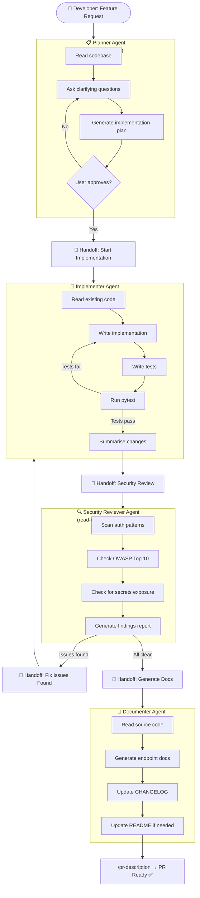
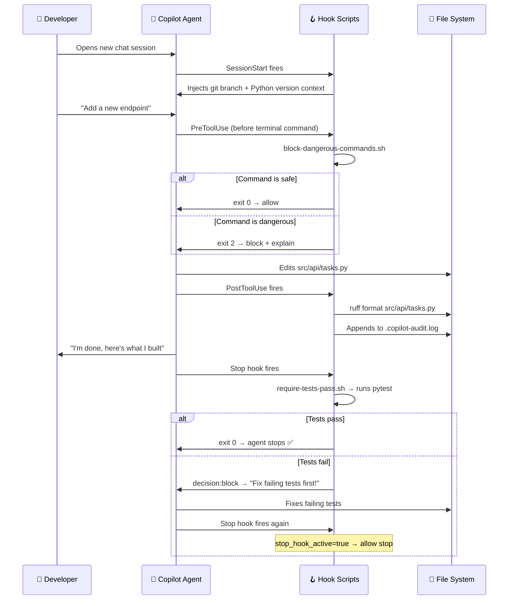
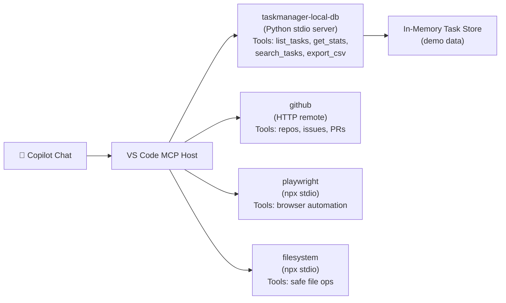
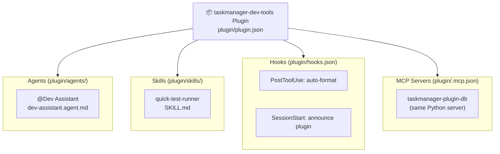

# Agent Handoff Workflow Diagrams

## Feature Development Pipeline

```mermaid
flowchart TD
    Start([🧑 Developer: Feature Request]) --> Planner

    subgraph Planner["📋 Planner Agent\n(read-only tools)"]
        P1[Read codebase] --> P2[Ask clarifying questions]
        P2 --> P3[Generate implementation plan]
        P3 --> P4{User approves?}
    end

    P4 -->|Yes| HandoffImpl["🤝 Handoff: Start Implementation"]
    P4 -->|No| P2

    HandoffImpl --> Implementer

    subgraph Implementer["🔧 Implementer Agent\n(full tools)"]
        I1[Read existing code] --> I2[Write implementation]
        I2 --> I3[Write tests]
        I3 --> I4[Run pytest]
        I4 -->|Tests fail| I2
        I4 -->|Tests pass| I5[Summarise changes]
    end

    I5 --> HandoffSec["🤝 Handoff: Security Review"]

    subgraph Reviewer["🔍 Security Reviewer Agent\n(read-only tools)"]
        S1[Scan auth patterns] --> S2[Check OWASP Top 10]
        S2 --> S3[Check for secrets exposure]
        S3 --> S4[Generate findings report]
    end

    HandoffSec --> Reviewer

    S4 -->|Issues found| HandoffFix["🤝 Handoff: Fix Issues Found"]
    S4 -->|All clear| HandoffDoc["🤝 Handoff: Generate Docs"]

    HandoffFix --> Implementer
    HandoffDoc --> Documenter

    subgraph Documenter["📝 Documenter Agent\n(read + write to docs/)"]
        D1[Read source code] --> D2[Generate endpoint docs]
        D2 --> D3[Update CHANGELOG]
        D3 --> D4[Update README if needed]
    end

    D4 --> PR["/pr-description → PR Ready ✅"]
```

---

## Hook Lifecycle

```mermaid
sequenceDiagram
    participant Dev as 🧑 Developer
    participant Copilot as 🤖 Copilot Agent
    participant Hook as 🪝 Hook Scripts
    participant FS as 📁 File System

    Dev->>Copilot: Opens new chat session
    Copilot->>Hook: SessionStart fires
    Hook->>Copilot: Injects git branch + Python version context
    
    Dev->>Copilot: "Add a new endpoint"
    Copilot->>Hook: PreToolUse (before terminal command)
    Hook->>Hook: block-dangerous-commands.sh
    alt Command is safe
        Hook->>Copilot: exit 0 → allow
    else Command is dangerous
        Hook->>Copilot: exit 2 → block + explain
    end

    Copilot->>FS: Edits src/api/tasks.py
    Copilot->>Hook: PostToolUse fires
    Hook->>FS: ruff format src/api/tasks.py
    Hook->>FS: Appends to .copilot-audit.log

    Copilot->>Dev: "I'm done, here's what I built"
    Copilot->>Hook: Stop hook fires
    Hook->>Hook: require-tests-pass.sh → runs pytest
    alt Tests pass
        Hook->>Copilot: exit 0 → agent stops ✅
    else Tests fail
        Hook->>Copilot: decision:block → "Fix failing tests first!"
        Copilot->>FS: Fixes failing tests
        Copilot->>Hook: Stop hook fires again
        Note over Hook: stop_hook_active=true → allow stop
    end
```

---

## MCP Architecture

```mermaid
graph LR
    Chat["🤖 Copilot Chat"] --> MCPHost["VS Code MCP Host"]
    
    MCPHost --> LocalDB["taskmanager-local-db\n(Python stdio server)\nTools: list_tasks, get_stats,\nsearch_tasks, export_csv"]
    MCPHost --> GitHub["github\n(HTTP remote)\nTools: repos, issues, PRs"]
    MCPHost --> Playwright["playwright\n(npx stdio)\nTools: browser automation"]
    MCPHost --> FS["filesystem\n(npx stdio)\nTools: safe file ops"]

    LocalDB --> InMemory["In-Memory Task Store\n(demo data)"]
```

---

## Plugin Architecture

```mermaid
graph TD
    Plugin["📦 taskmanager-dev-tools Plugin\nplugin/plugin.json"] --> Agents
    Plugin --> Skills
    Plugin --> Hooks
    Plugin --> MCP

    subgraph Agents["Agents (plugin/agents/)"]
        DevAssistant["@Dev Assistant\ndev-assistant.agent.md"]
    end

    subgraph Skills["Skills (plugin/skills/)"]
        TestRunner["quick-test-runner\nSKILL.md"]
    end

    subgraph Hooks["Hooks (plugin/hooks.json)"]
        Format["PostToolUse: auto-format"]
        Welcome["SessionStart: announce plugin"]
    end

    subgraph MCP["MCP Servers (plugin/.mcp.json)"]
        PMCP["taskmanager-plugin-db\n(same Python server)"]
    end
```
